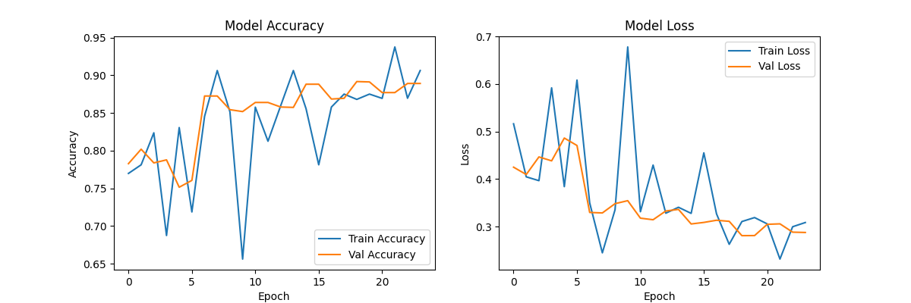

# Classical Convolutional Neural Network (CNN) for Skin Cancer Detection

This project implements a **Mini-VGGNet** style Convolutional Neural Network built from scratch using **TensorFlow/Keras**. It is designed for the binary classification of skin lesions (Benign vs. Malignant), leveraging a custom architecture optimized for feature extraction and translation invariance.

## 0. Initialization
The environment is set up using **TensorFlow** with GPU support.
- **Hardware:** NVIDIA Quadro RTX 8000 (48GB VRAM).
- **Environment:** Custom Conda environment with `tensorflow`, `numpy`, `scikit-learn`, and `matplotlib`.

## 1. Data Configuration
Data loading and preprocessing are handled via the TensorFlow `ImageDataGenerator`.

* **Training Set:** Applies real-time data augmentation to prevent overfitting. Techniques include rotation, width/height shifts, shearing, and zooming.
* **Validation/Test Set:** Rescaled only ($1/255$) to maintain data integrity for evaluation.

## 2. Custom CNN Model Architecture
The model follows a "Mini-VGGNet" structure, sequentially increasing feature depth while reducing spatial dimensions.

### 2.1 The Convolution Layers (`Conv2D`)
The network uses a stack of three convolution blocks.
* **1st Block (32 Filters):** Acts as a low-level feature detector, capturing vertical edges, horizontal lines, and color blobs.
* **Later Blocks (64 & 128 Filters):** These layers combine low-level features to recognize complex shapes, such as skin texture patterns or specific lesion irregularities.
* **Kernel Size (3, 3):** We use the "Gold Standard" $3 \times 3$ window. This is the smallest size in deep learning capable of capturing spatial notions of left/right and up/down.
* **Activation Function (ReLU):** $f(x) = \max(0, x)$. This turns negative values to zero, allowing the model to learn non-linear data boundaries effectively and preventing the "vanishing gradient problem."

### 2.2 The Pooling Layers (`MaxPooling2D`)
We utilize Max Pooling with a pool size of **(2, 2)** after every convolution block.
* **Function:** Takes a $2 \times 2$ grid of pixels and retains only the highest value.
* **Dimensionality Reduction:** Cuts image height and width in half (e.g., $224 \times 224 \rightarrow 112 \times 112$), reducing the number of pixels for faster training.
* **Translation Invariance:** This is the critical feature of pooling. It ensures the model is robust to slight shifts in position.

> **"I don't care if the cancer spot is at pixel 50 or pixel 51. As long as it is generally in this area, I will detect it."**

**Why Pooling is Essential:**
1.  **With Pooling (Flexible):** The layer detects a feature (e.g., a sharp edge) somewhere in a $2 \times 2$ block. If the edge moves by 1 pixel, the output remains the same. The result is **stable**.
2.  **Without Pooling (Rigid):** The convolution layer detects an edge exactly at Pixel $(10, 10)$. If the lesion shifts just 1 pixel to the right to $(10, 11)$, the next layer looking at $(10, 10)$ might say, *"I don't see anything here anymore."*

### 3. The Classifier Head
Once features are extracted, the data moves to the Fully Connected (Dense) layers.
* **Flatten:** Converts the 3D block of features (e.g., $28 \times 28 \times 128$) into a long 1D vector.
* **Dense (512):** A fully connected layer that looks at all extracted features globally to make sense of the image.
* **Dropout (0.5):** Randomly turns off 50% of the neurons during training. This forces the network to learn robust features and prevents overfitting.
* **Output Layer:** A single neuron with **Sigmoid activation**, providing a binary probability (0 or 1).

### Architecture Summary
1.  **Input:** $224 \times 224$ Image.
2.  **Block 1:** Detects simple edges (32 filters) $\rightarrow$ Shrink Image.
3.  **Block 2:** Detects textures/shapes (64 filters) $\rightarrow$ Shrink Image.
4.  **Block 3:** Detects complex lesion parts (128 filters) $\rightarrow$ Shrink Image.
5.  **Classifier:** Aggregates features (Dense 512) $\rightarrow$ Throws away noise (Dropout 0.5) $\rightarrow$ Decision (Sigmoid).

---

## 4. Hardware Performance
* **GPU:** NVIDIA Quadro RTX 8000.
* **Temperature:** Reached ~83°C during training.
* **Memory Usage:** 4.2GB / 49GB.
    * *Observation:* The VRAM was significantly underutilized with a batch size of 32. Increasing the batch size to **128 or 256** is recommended for future runs to maximize throughput.
* **Bottleneck:** The GPU is extremely fast, often waiting for the CPU to resize and augment the next batch of images.

## 5. Results
The model demonstrated strong learning capabilities over 30 epochs.

* **Accuracy:** Validation accuracy improved steadily from **78%** to **~89%**.
* **Loss:** Both training and validation loss dropped consistently, ending around **0.3**. This confirms the model is genuinely learning features rather than memorizing the dataset.

## 6. Discussion
**Why did Training Accuracy spike (Blue Line)?**
The training accuracy graph shows significant volatility (e.g., a crash around epoch 9). This is likely due to the small **Batch Size (32)**. With a small batch, a few difficult or "outlier" images can cause the model weights to overreact, resulting in a spiky graph.

**Why is Validation Accuracy (Orange) higher than Training Accuracy (Blue)?**
It is unusual for validation to perform better than training, but in this case, it is expected:
1.  **High Dropout:** We use `Dropout(0.5)`, meaning the model is "crippled" by 50% during training (making it hard), but runs at full capacity during validation (making it easy).
2.  **Data Augmentation:** The training images are constantly being rotated and distorted (hard to read), while the validation images are clean and perfectly centered.